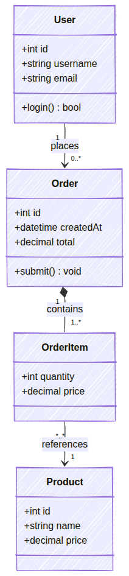

# MermZen

  

**MermZen** is a clean, lightweight Mermaid diagram editor. Open it, write syntax, see your diagram — that's the whole experience. No setup, no friction, just the diagram.

The name blends **Mermaid** (the diagram syntax) and **Zen** (simplicity). Design and lightness are the point.

**Live demo: [MermZen](https://eric.run.place/MermZen/)**

[中文文档](README.zh.md)

---

## Preview

The diagrams below were exported directly from MermZen in hand-drawn style. The exported SVG can be pasted straight into any HTML page — or embed a live, interactive diagram via `<iframe>`:

  
  &nbsp;
  

  

---

## Why MermZen

Mermaid's official live editor is cluttered and overcomplicated: AI upsells, membership prompts, and redundant panels crowd the screen. The interface keeps growing heavier — you just want to write syntax and see a diagram, but instead you're navigating a product that has lost sight of that.

MermZen fills that gap: a CodeMirror 6 editor with Mermaid-aware syntax highlighting, inline error hints with line numbers, and a full keyboard shortcut system. Diagrams are encoded directly in the URL hash, so sharing requires no backend, no account, and no expiring links — just copy the URL.

---

## Features

**Editor**
- CodeMirror 6 with Mermaid syntax highlighting and autocomplete
- Inline error display pinpointed to the exact line
- Code formatter and command palette (`Ctrl+K`)
- Full keyboard shortcut system

**Preview**
- Live rendering as you type (300ms debounce)
- 11 diagram types: flowchart, sequence, class, Gantt, pie, mindmap, ER, state, architecture, gitGraph, block-beta
- Pan, zoom, and checkerboard background for transparent diagrams
- Right-click context menu for quick export

**Output**
- Export SVG or PNG (PNG rendered at 2× resolution)
- Copy PNG directly to clipboard
- Shareable URL — diagram state encoded in the URL hash, no server needed
- Embeddable iframe via `embed.html` — paste `<iframe src="…/embed.html#code">` into any page for a live, hand-drawn diagram with zero dependencies

**Appearance**
- Hand-drawn style mode (with Chinese handwriting font support)
- 5 Mermaid themes + dark / light UI toggle

**Onboarding**
- Built-in example templates
- Interactive tour for first-time users

---

## Keyboard Shortcuts

| Action | Shortcut |
| --- | --- |
| Save (choose format) | `Ctrl+S` |
| Copy PNG | `Ctrl+Shift+C` |
| Format code | `Ctrl+Shift+F` |
| Command palette | `Ctrl+K` |
| File / Edit / View / Help menu | `Alt+F/E/V/H` |
| Switch preview background | `Alt+1/2/3/4` |

## Tech Stack

- [Mermaid 11](https://mermaid.js.org/) — diagram rendering
- [CodeMirror 6](https://codemirror.net/) — code editor

