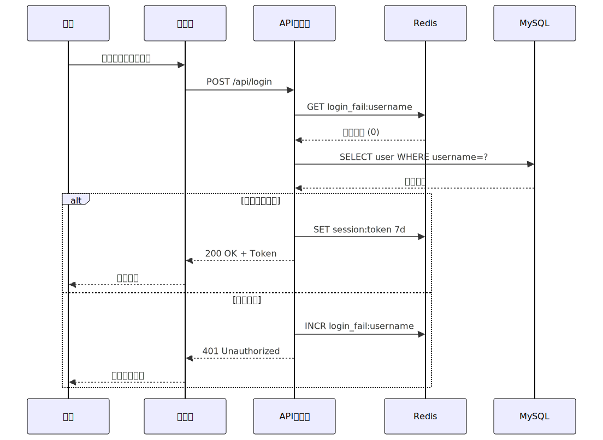

# MermZen

<p align="center">
  
</p>

[](https://github.com/caoergou/mermzen/actions/workflows/deploy.yml)
[](LICENSE)
[](https://github.com/caoergou/mermzen/stargazers)

**MermZen** 是一个简洁轻量的 Mermaid 图表编辑器。打开即用，写语法，看图表——体验就这么简单，没有多余的东西。

名称取自 **Mermaid**（图表语法）与 **Zen**（禅）——设计感与轻量化是它的核心。

**在线体验：[MermZen](https://eric.run.place/MermZen/)**

[English](README.md)

---

## 效果预览

下面的图表均由 MermZen 直接导出，手绘风格。导出的 SVG 可直接粘贴进任何 HTML 页面使用；也可通过 `<iframe>` 嵌入一个实时交互的动态图表：

<p align="center">
  
  &nbsp;
  
</p>

<p align="center">
  
</p>

---

## 为什么做 MermZen

Mermaid 官方的在线编辑器能应付简单的草图，但当你需要一个真正的编辑环境时——精确的语法报错、键盘驱动的操作流、主题控制、或者一种无需部署服务就能分享图表的方式——它就力不从心了。

MermZen 填补这个空缺：基于 CodeMirror 6 构建，支持 Mermaid 语法高亮与自动补全，错误提示精确到行；图表内容编码在 URL hash 中，分享时无需后端、无需账号、链接永不失效，复制 URL 即可。

整个应用是纯 HTML + CSS + JS 的静态文件，没有构建流程，没有框架依赖，没有部署复杂度。可以 Fork 后部署在任意地方，也可以用一行命令在本地运行。

---

## 主要功能

**编辑器**
- CodeMirror 6，支持 Mermaid 语法高亮与自动补全
- 错误提示精确到行号，快速定位语法问题
- 代码格式化与命令面板（`Ctrl+K`）
- 完整的键盘快捷键体系

**预览**
- 实时渲染，输入后 300ms 自动更新
- 支持 11 种图表类型：流程图、时序图、类图、甘特图、饼图、思维导图、ER 图、状态图、架构图、Git 图、块图
- 预览区支持缩放、平移，棋盘格背景便于查看透明图
- 右键上下文菜单，快速导出

**输出**
- 导出 SVG 或 PNG（PNG 以 2 倍分辨率渲染，适合高清场景）
- 直接复制 PNG 到剪贴板
- 分享链接——图表状态编码在 URL hash 中，无需服务端
- iframe 嵌入——通过 `embed.html` 将动态手绘图表嵌入任何网页，零依赖

**外观**
- 手绘风格模式（支持中文手写字体）
- 5 种 Mermaid 主题，支持深色 / 浅色 UI 切换

**上手引导**
- 内置示例模板
- 交互式引导教程，首次使用可快速了解所有功能

---

## 快捷键

| 操作 | 快捷键 |
| --- | --- |
| 保存（选格式） | `Ctrl+S` |
| 复制 PNG | `Ctrl+Shift+C` |
| 格式化代码 | `Ctrl+Shift+F` |
| 命令面板 | `Ctrl+K` |
| 文件/编辑/视图/帮助菜单 | `Alt+F/E/V/H` |
| 切换预览背景 | `Alt+1/2/3/4` |

## 本地运行

无需构建与包管理器，用静态服务器即可：

```bash
python3 -m http.server
# 访问 http://localhost:8000
```

或直接在浏览器中打开 `index.html`。
