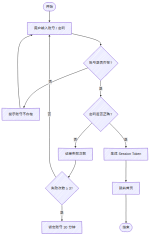
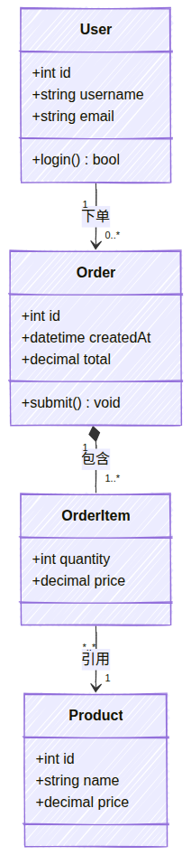
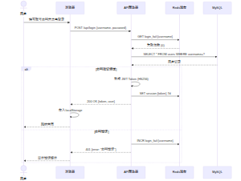

# MermZen

  

**MermZen** 是一款纯粹的 Mermaid 图表编辑器。打开即写，实时渲染，零干扰。

名字源于 **Mermaid**（图表语法）+ **Zen**（禅），追求极简设计与轻量体验。

**在线体验：[MermZen](https://eric.run.place/MermZen/)**

[English](README.md)

---

## 效果预览

下方图表均由 MermZen 导出（手绘风格）。导出的 SVG 可直接嵌入 HTML 页面，也可通过 `<iframe>` 嵌入实时交互图表：

  
  &nbsp;
  

  

---

## 为什么做 MermZen

Mermaid 官方编辑器越来越臃肿：AI 推荐、会员弹窗、冗余面板占满屏幕。你只想写几行代码看个图，却要先绕过一堆干扰。

MermZen 回归本质：基于 CodeMirror 6，支持语法高亮、自动补全、行级错误提示；图表编码在 URL hash 中，分享无需后端、无需账号、链接永久有效。

---

## 主要功能

**编辑器**
- CodeMirror 6 编辑器，Mermaid 语法高亮与自动补全
- 行级错误提示，快速定位问题
- 代码格式化与命令面板（`Ctrl+K`）
- 完整快捷键支持

**预览**
- 实时渲染（300ms 防抖）
- 支持 11 种图表：流程图、时序图、类图、甘特图、饼图、思维导图、ER 图、状态图、架构图、Git 图、块图
- 缩放、平移、棋盘格背景
- 右键菜单快速导出

**输出**
- 导出 SVG 或 PNG（2× 分辨率）
- 复制 PNG 到剪贴板
- URL 分享——图表编码在 hash 中，无需服务器
- iframe 嵌入——通过 `embed.html` 嵌入任何网页

**外观**
- 手绘风格（含中文手写字体）
- 5 种 Mermaid 主题 + 深色/浅色 UI

**引导**
- 内置示例模板
- 交互式新手教程

---

## 快捷键

| 操作 | 快捷键 |
| --- | --- |
| 保存（选择格式） | `Ctrl+S` |
| 复制 PNG | `Ctrl+Shift+C` |
| 格式化代码 | `Ctrl+Shift+F` |
| 命令面板 | `Ctrl+K` |
| 文件/编辑/视图/帮助 | `Alt+F/E/V/H` |
| 切换预览背景 | `Alt+1/2/3/4` |

## 技术栈

- [Vite 7](https://vitejs.dev/) — 构建工具与开发服务器
- [TypeScript](https://www.typescriptlang.org/) — 类型安全
- [Mermaid 11](https://mermaid.js.org/) — 图表渲染引擎
- [CodeMirror 6](https://codemirror.net/) — 代码编辑器
- [SVGO](https://github.com/svg/svgo) — SVG 优化
- [pako](https://github.com/nodeca/pako) — URL 压缩

所有依赖本地打包，运行时零 CDN 依赖。

